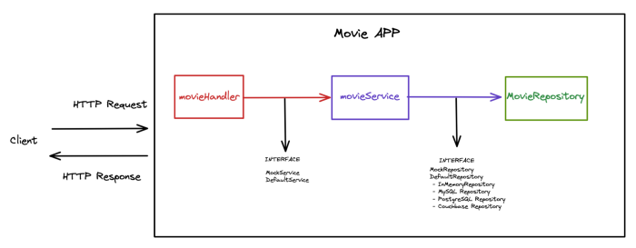
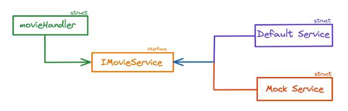
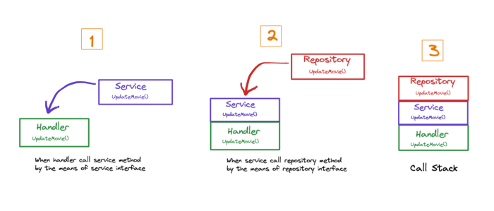

# Let’s Build a Movie API With Separated Layered Architecture Using Go

The goal of software architecture is to minimize the human resources required to build and maintain the required system. [1]

*The idea of a layered architecture is built on the idea of programming to interfaces. When one module interacts with another though an interface, you can substitute one service provider for another [2].*

Let’s look at this diagram below. Look simple, right?



The logic behind this architecture every single layer has its own responsibility and they will be independent of each other. In that way, we can test them in a more isolable way. Yeap, again testing!

What are the roles of these layers (handler, service, and repository)?

**Handler**: It is a layer which gets http request and returns http response to the client.

**Service**: It is a layer where our business logic is in.

**Repository**: It is a layer which provides all necessary data from external (DBs) or internal (in-memory) data source. For simplicity, we use in-memory.

We need to talk about **Dependency injection** before learning the role of interfaces in a diagram. Dependency injection is based on only abstractions (interfaces) not concrete types (structs). In that manner, we inject all our dependencies by using interfaces.

For example, we will have two services in the project: `MockService` and `DefaultService`.With the help of the service interface, we can use the methods of these two different structs in the Handler layer. In testing stage, Handler interact with `MockService` , on the other hand, it interact with `DefaultService` in production.

**Dependency Inversion Example**



Don’t worry, you will understand better when we’ll see the action:

```go
type movieHandler struct {
	service service.IMovieService
}

func NewMovieHandler(ms service.IMovieService) *movieHandler {
	return &movieHandler{service: ms}
}

//curl -X PATCH "localhost:8080/movies/1" -d '{ "title": "Beautiful film" }'
func (mh *movieHandler) UpdateMovie(w http.ResponseWriter, r *http.Request, ps httprouter.Params) {
  // some piece of code
	err = mh.service.UpdateMovie(id, movie)
  // some piece of code
}
```

```go
type DefaultMovieService struct {
	movieRepo repository.IMovieRepository
}

func NewDefaultMovieService(mRepo repository.IMovieRepository) *DefaultMovieService {
	return &DefaultMovieService{
		movieRepo: mRepo,
	}
}

func (d *DefaultMovieService) UpdateMovie(id int, movie model.Movie) error {
	// some piece of code
	err := d.movieRepo.UpdateMovie(id, movie)
  // some piece of code
}
```

```go
type inmemoryMovieRepository struct {
	Movies []model.Movie
}

func NewInMemoryMovieRepository() *inmemoryMovieRepository {
	var movies = []model.Movie{
		{ID: 1, Title: "The Shawshank Redemption", ReleaseYear: 1994, Score: 9.3},
		{ID: 2, Title: "The Godfather", ReleaseYear: 1972, Score: 9.2},
		{ID: 3, Title: "The Dark Knight", ReleaseYear: 2008, Score: 9.0},
	}
	return &inmemoryMovieRepository{
		Movies: movies,
	}
}
func (i *inmemoryMovieRepository) UpdateMovie(id int, movie model.Movie) error {
	// some piece of code
}
```

Actually, when we call the service method in Handler and the repository method in Service, its reasonable to think of this relations as “call stack”.



This is the simple diagram that we did with the call stack. Our computer allocates memory for our function call.

Let’s imagine this memory as a box.

Our first call(in `Handler`) needs to be saved in memory.

Then, our second call(in `Service`) is saved in memory upon the Handler box.

Then, our third call(in `Repository`) is saved in memory upon Service box. The tricky is here is that our service needs to wait for the repository function to be done. When it is done, our handler needs to wait for the service function to be done. When it is done, the `Handler` function can do its work.

After it is done too, our stack will be empty. This is how the call stack works. You can read the ‘Grokking Algorithms Book’s Call Stack section to learn more.

This is the broad perspective of how our design is created. We can go deep into our project. We will handle just an example of PATCH request along with this article.

## 1. main.go

When the client send request with PATCH method, movieHandler’s UpdateMovie method is called using `httprouter`.

**main.go**

```go
package main

import (
	"github.com/dilaragorum/movie-go/handler"
	"github.com/dilaragorum/movie-go/repository"
	"github.com/dilaragorum/movie-go/service"
	"github.com/julienschmidt/httprouter"
	"log"
	"net/http"
)

func main() {
	movieInMemoryRepository := repository.NewInMemoryMovieRepository()
	movieService := service.NewDefaultMovieService(movieInMemoryRepository)
	movieHandler := handler.NewMovieHandler(movieService)

	router := httprouter.New()

	router.PATCH("/movies/:id", movieHandler.UpdateMovie)

	log.Println("http server runs on :8080")
	err := http.ListenAndServe(":8080", router)
	log.Fatal(err)
}
```

## 2a. Handler

This is the first layer where our API gets HTTP request.

**movie_handler.go**

```go
package handler

import (
	"encoding/json"
	"errors"
	"github.com/dilaragorum/movie-go/model"
	"github.com/dilaragorum/movie-go/service"
	"github.com/julienschmidt/httprouter"
	"net/http"
	"strconv"
)

type movieHandler struct {
	service service.IMovieService
}

func NewMovieHandler(ms service.IMovieService) *movieHandler {
	return &movieHandler{service: ms}
}

// curl -X PATCH "localhost:8080/movies/1" -d '{ "title": "Beautiful film" }'
func (mh *movieHandler) UpdateMovie(w http.ResponseWriter, r *http.Request, ps httprouter.Params) {
	id, _ := strconv.Atoi(ps.ByName("id"))

	var movie model.Movie
	err := json.NewDecoder(r.Body).Decode(&movie)
	if err != nil {
		http.Error(w, "error when decoding json", http.StatusInternalServerError)
		return
	}

	err = mh.service.UpdateMovie(id, movie)

	if err != nil {
		if errors.Is(err, service.ErrIDIsNotValid) ||
			errors.Is(err, service.ErrTitleIsNotEmpty) {
			http.Error(w, err.Error(), http.StatusBadRequest)
			return
		} else if errors.Is(err, service.ErrMovieNotFound) {
			http.Error(w, err.Error(), http.StatusNotFound)
			return
		}
		http.Error(w, err.Error(), http.StatusInternalServerError)
		return
	}

	w.WriteHeader(http.StatusNoContent)
	w.Write([]byte("Successfully Updated"))
}
```

Handler is the layer which transform response coming from service to http response. As you know, HTTP response is constituted of a status code, header and body.

## 2b. Handler Testing

Before continuing testing of the handler, I want to introduce [mockgen package](https://github.com/golang/mock). This package helps our code to test easily.

Give it the interface source path which you want to mock, show it where the auto-generated mock file will be created and let it generate mock struct implementation on behalf of you. If we want to test the handler layer, we need to mock the service layer. We can do that install it like this:

```sh
$ mockgen -source service/movie_service_interface.go -destination service/mock_movie_service.go -package service
```

In the test file, we should test possible errors and success cases to increase the test coverage of the handler.

**movie_handler_test.go**

```go
func TestMovieHandler_UpdateMovie(t *testing.T) {
	movieID := "1"
	requestURL := fmt.Sprintf("/movies/%s", movieID)
	updatedMovie := model.Movie{Title: "Test Movie"}
	jsonStr, _ := json.Marshal(updatedMovie)
	ps := httprouter.Params{
		{Key: "id", Value: movieID},
	}

	t.Run("update movie error - Bad Request", func(t *testing.T) {
		type testCase struct {
			returnedServiceErr     error
			expectedHTTPStatusCode int
		}

		testErrors := []testCase{
			{returnedServiceErr: service.ErrIDIsNotValid, expectedHTTPStatusCode: http.StatusBadRequest},
			{returnedServiceErr: service.ErrTitleIsNotEmpty, expectedHTTPStatusCode: http.StatusBadRequest},
		}

		for _, testError := range testErrors {
			req, _ := http.NewRequest(http.MethodPatch, requestURL, bytes.NewBuffer(jsonStr))
			rec := httptest.NewRecorder()

			mockService := service.NewMockIMovieService(gomock.NewController(t))
			mockService.
				EXPECT().
				UpdateMovie(1, updatedMovie).
				Return(testError.returnedServiceErr).
				Times(1)

			mh := NewMovieHandler(mockService)
			mh.UpdateMovie(rec, req, ps)

			assert.Equal(t, testError.expectedHTTPStatusCode, rec.Code)
		}
	})

	t.Run("update movie error - Status Not Found Error", func(t *testing.T) {
		req, _ := http.NewRequest(http.MethodPatch, requestURL, bytes.NewBuffer(jsonStr))
		rec := httptest.NewRecorder()

		mockService := service.NewMockIMovieService(gomock.NewController(t))
		mockService.
			EXPECT().
			UpdateMovie(1, updatedMovie).
			Return(service.ErrMovieNotFound).
			Times(1)

		mh := NewMovieHandler(mockService)
		mh.UpdateMovie(rec, req, ps)

		assert.Equal(t, http.StatusNotFound, rec.Code)
	})

	t.Run("update movie error - Internal Server Error", func(t *testing.T) {
		req, _ := http.NewRequest(http.MethodPatch, requestURL, bytes.NewBuffer(jsonStr))
		rec := httptest.NewRecorder()

		mockService := service.NewMockIMovieService(gomock.NewController(t))
		mockService.
			EXPECT().
			UpdateMovie(1, updatedMovie).
			Return(errors.New("")).
			Times(1)

		mh := NewMovieHandler(mockService)
		mh.UpdateMovie(rec, req, ps)

		assert.Equal(t, http.StatusInternalServerError, rec.Code)
	})

	t.Run("update movie successfully", func(t *testing.T) {
		req, _ := http.NewRequest(http.MethodPatch, requestURL, bytes.NewBuffer(jsonStr))
		rec := httptest.NewRecorder()

		mockService := service.NewMockIMovieService(gomock.NewController(t))
		mockService.
			EXPECT().
			UpdateMovie(1, updatedMovie).
			Return(nil).
			Times(1)

		mh := NewMovieHandler(mockService)
		mh.UpdateMovie(rec, req, ps)

		assert.Equal(t, http.StatusNoContent, rec.Code)
		assert.Equal(t, "Successfully Updated", rec.Body.String())
	})
}
```

## 3a. Service

This layer includes our app business logic. By separating business logic into a specific layer, we can write unit tests easily.

**default_movie_service.go**

```go
package service

import (
	"errors"
	"github.com/dilaragorum/movie-go/model"
	"github.com/dilaragorum/movie-go/repository"
)

var (
	ErrIDIsNotValid    = errors.New("id is not valid")
	ErrTitleIsNotEmpty = errors.New("Movie title cannot be empty")
	ErrMovieNotFound   = errors.New("the movie cannot be found")
)

type DefaultMovieService struct {
	movieRepo repository.IMovieRepository
}

func NewDefaultMovieService(mRepo repository.IMovieRepository) *DefaultMovieService {
	return &DefaultMovieService{
		movieRepo: mRepo,
	}
}

func (d *DefaultMovieService) UpdateMovie(id int, movie model.Movie) error {
	if id <= 0 {
		return ErrIDIsNotValid
	}

	if movie.Title == "" {
		return ErrTitleIsNotEmpty
	}

	err := d.movieRepo.UpdateMovie(id, movie)
	if errors.Is(err, repository.ErrMovieNotFound) {
		return ErrMovieNotFound
	}

	return nil
}
```

## 3b. Service Testing

Like in the handler testing section, we need to mock our repository to test our service layer:

```sh
mockgen -source repository/movie_repository_interface.go -destination repository/mock_movie_repository.go -package repository
```

I will give you a trick. Whenever we change interfaces that we give to `mockgen`, we have to run `mockgen` command again.

Until now, we have two mock files and we need to write these long codes over and over when we add a new method to our interface. Such a tedious way! The solution is `Makefile`. With the `Makefile`, we use just `generate-mocks` command to recreate our mock files.(`make generate-mocks`)

We are testing possible errors by mocking the repository.

**default_movie_service_test.go**

```go
func TestDefaultMovieService_UpdateMovie(t *testing.T) {
	t.Run("Error Update Movie - IDIsNotValid", func(t *testing.T) {
		ms := NewDefaultMovieService(nil)
		err := ms.UpdateMovie(0, model.Movie{Title: ""})
		assert.ErrorIs(t, err, ErrIDIsNotValid)
	})
	t.Run("Error Update Movie - ErrTitleIsNotEmpty", func(t *testing.T) {
		ms := NewDefaultMovieService(nil)
		err := ms.UpdateMovie(3, model.Movie{Title: ""})
		assert.ErrorIs(t, err, ErrTitleIsNotEmpty)
	})
	t.Run("Error Update Movie - ErrMovieNotFound", func(t *testing.T) {
		movie := model.Movie{Title: "Test Movie"}
		mockRepository := repository.NewMockIMovieRepository(gomock.NewController(t))
		mockRepository.
			EXPECT().
			UpdateMovie(6, movie).
			Return(repository.ErrMovieNotFound).
			Times(1)

		ms := NewDefaultMovieService(mockRepository)
		err := ms.UpdateMovie(6, movie)

		assert.ErrorIs(t, err, ErrMovieNotFound)
	})

	t.Run("Error Update Movie - ErrMovieNotFound", func(t *testing.T) {
		movie := model.Movie{Title: "Test Movie"}
		mockRepository := repository.NewMockIMovieRepository(gomock.NewController(t))
		mockRepository.
			EXPECT().
			UpdateMovie(2, movie).
			Return(nil).
			Times(1)

		ms := NewDefaultMovieService(mockRepository)
		err := ms.UpdateMovie(2, movie)

		assert.Nil(t, err)
	})
}
```

## 4. Repository

This is where our data integration is implemented:

**inmemory_movie_repository.go**

```go
package repository

import (
	"errors"
	"github.com/dilaragorum/movie-go/model"
)

var (
	ErrMovieNotFound = errors.New("FromRepository - movie not found")
)

type inmemoryMovieRepository struct {
	Movies []model.Movie
}

func NewInMemoryMovieRepository() *inmemoryMovieRepository {
	var movies = []model.Movie{
		{ID: 1, Title: "The Shawshank Redemption", ReleaseYear: 1994, Score: 9.3},
		{ID: 2, Title: "The Godfather", ReleaseYear: 1972, Score: 9.2},
		{ID: 3, Title: "The Dark Knight", ReleaseYear: 2008, Score: 9.0},
	}

	return &inmemoryMovieRepository{
		Movies: movies,
	}
}

func (i *inmemoryMovieRepository) UpdateMovie(id int, movie model.Movie) error {
	for k := 0; k < len(i.Movies); k++ {
		if i.Movies[k].ID == id {
			i.Movies[k].Title = movie.Title
			return nil
		}
	}

	return ErrMovieNotFound
}
```

**References**

[1,2] Clean Architecture A Craftsman’s Guide to Software Structure and Design (Robert C. Martin)

[3] 97 things every programmer should know collective wisdom from the experts by Kevlin Henney