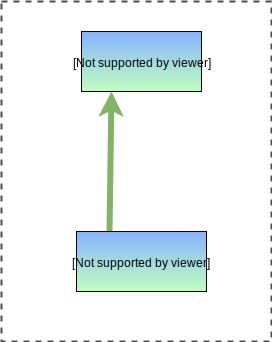

# An Introduction to Channels in Go

This post highlights how channels work in Go, and how you can use them in your code.

In Go, a channel is a programming construct that allows us to move data between different parts of our code, often from different goroutines.

## Why Do We Need Channels?

To understand channels, we must know how to visualize goroutines first.

Let’s start with a simple goroutine that takes a number, multiplies it by two, and prints its value:

```go
package main

import (
	"fmt"
	"time"
)

func main() {
	n := 3

	// We want to run a goroutine to multiply n by 2
	go multiplyByTwo(n)

	// We pause the program so that the `multiplyByTwo` goroutine
	// can finish and print the output before the code exits
	time.Sleep(time.Second)
}

func multiplyByTwo(num int) int {
	result := num * 2
	fmt.Println(result)
	return result
}
```

We can visualize this program as a set of two blocks: one being the main function, and the other being the `multiplyByTwo` goroutine.


The problem with this implementation is that these two parts of our code are rather disconnected. As a consequence :

- We cannot access the result of `multiplyByTwo` in the `main` function.
- We have no way to know when the `multiplyByTwo` goroutine completes. Because of this, we have to pause the main function by calling `time.Sleep`, which is suboptimal at best.

## Creating a New Channel

We can declare a new channel type by using the `chan` keyword along with a datatype:

```go
var c chan int
```

Here, `c` is of type `chan int` - which means it’s a channel through which `int` types are sent. The default value of a channel is `nil`, so we need to assign a value.

## Adding Channels Between Goroutines

Now let’s look at some code that makes use of a channel to get the multiplication result:

```go
package main

import (
	"fmt"
)

func main() {
	n := 3

	// This is where we "make" the channel, which can be used
	// to move the `int` datatype
	out := make(chan int)

	// We still run this function as a goroutine, but this time,
	// the channel that we made is also provided
	go multiplyByTwo(n, out)

	// Once any output is received on this channel, print it to the console and proceed
	fmt.Println(<-out)
}

// This function now accepts a channel as its second argument...
func multiplyByTwo(num int, out chan<- int) {
	result := num * 2

	//... and pipes the result into it
	out <- result
}
```

A channel gives us a way to “connect” the different concurrent parts of our program. In this case, we can represent this connection between our two concurrent blocks of code visually:



*The green arrow here signifies data going through a channel.*

Channels can be thought of as “pipes” or “arteries” that connect the different concurrent parts of our code.

## Directional Channels

Channels can be directional - which means that you can restrict a channel to only send or receive data. This is specified by the arrow (`<-`) accompanied with the channel declaration.

For example, take a look at the type definition of the `out` argument of the `multiplyByTwo` function:

```go
out chan<- int
```

- The `chan<-` declaration tells us that you can only send data into the channel, but not receive data from it.
- The `int` declaration tells us that the channel will only accept int datatypes.

Although they look like separate parts, `chan<- int` can be thought of as one datatype, that describes a “send-only” channel of integers.

Similarly, an example of a “receive-only” channel declaration would look like:

```go
out <-chan int
```

You can also declare a channel without giving directionality, which means it can send or receive data:

```go
out chan int
```

This is seen when we create the `out` channel in the `main` function:

```go
out := make(chan int)
```

This channel can then be cast into a directional channel based on the restrictions you want to impose elsewhere in your code.

## Blocking Statements

Statements that send or receive values from channels are blocking inside their own goroutine. This means:

- A statement to receive data from a channel will block until some data is received
- A statement to send data to a channel will wait until the sent data has been received

For example, when we try to print the value received (in the `main` function):

```go
fmt.Println(<-out)
```

The `<-out` statement will block the code until some data is received on the `out` channel. It helps to then visualize this by splitting the `main` block into two parts : the part that runs until its time to wait for the channel to receive data, and the part that is run after.


*The **dotted arrow** added here is to show that it is the main function that started the `multiplyByTwo` goroutine.*

The second part of `main` can only be run once data is received through the channel (depicted by the green arrow).

*Note: Sending or receiving data from a nil channel will also block forever.*

## Channel Workers

Example #1 can be implemented another way, by using 2 channels: one for sending data to the goroutine, and another for receiving the result.

A common pattern to distribute work to goroutines is to spawn persistent workers and send and receive information through channels.

```go
func main() {
	out := make(chan int)
	in := make(chan int)

	// Create 3 `multiplyByTwo` goroutines.
	go multiplyByTwo(in, out)
	go multiplyByTwo(in, out)
	go multiplyByTwo(in, out)

	// Up till this point, none of the created goroutines actually do
	// anything, since they are all waiting for the `in` channel to
	// receive some data, we can send this in another goroutine
	go func() {
		in <- 1
		in <- 2
		in <- 3
		in <- 4
	}()

	// Now we wait for each result to come in
	fmt.Println(<-out)
	fmt.Println(<-out)
	fmt.Println(<-out)
	fmt.Println(<-out)
}

func multiplyByTwo(in <-chan int, out chan<- int) {
	fmt.Println("Initializing goroutine...")
	for {
		num := <-in
		result := num * 2
		out <- result
	}
}
```

Now, in addition to `main`, `multiplyByTwo` is also divided into 2 parts: the part before and after the point where we wait on the `in` channel (`num := <- in`).


The number of workers spawned corresponds to the number of concurrent processes you want.

In the above example, we spawned three workers, and had four tasks. The first three tasks would immediately get a worker assigned, but the fourth task would have to wait until one of the workers was done.


Even though `task4` is ready, it needs to wait until at least one worker is free.

## The "Select" Statement

We can use the `select` statement when we have multiple channels waiting to receive information, and want to perform an action when *any one of them completes first*.

```go
select {
case res := <-someChannel:
	// do something
case anotherChannel <- someData:
	// do something else
case <- yetAnotherChannel:
	// do another thing
}
```

Here, the action performed depends on which of the cases completes first - the others will be ignored.

Let’s look at an example where we have a fast worker and a slow worker for multiplication:

```go
// The `fast` and `slow` functions do the same thing
// but `slow` takes more time to complete
func fast(num int, out chan<- int) {
	result := num * 2
	time.Sleep(5 * time.Millisecond)
	out <- result

}

func slow(num int, out chan<- int) {
	result := num * 2
	time.Sleep(15 * time.Millisecond)
	out <- result
}

func main() {
	out1 := make(chan int)
	out2 := make(chan int)

	// we start both fast and slow in different
	// goroutines with different channels
	go fast(2, out1)
	go slow(3, out2)

	// perform some action depending on which channel
	// receives information first
	select {
	case res := <-out1:
		fmt.Println("fast finished first, result:", res)
	case res := <-out2:
		fmt.Println("slow finished first, result:", res)
	}

}
```

If we run this code, we will get the output:

```bash
fast finished first, result: 4
```

The `select` statement is triggered by `out1` and ignores the action specified in the `out2` case:


A common use case for select statements is to detect when an action needs to be cancelled - if we’re performing a time-sensitive operation, we would ideally want to keep a deadline and fail fast if the operation stalls or takes too long.

## Buffered Channels

In the previous few examples, we saw that channel statements block until data is either sent into or received from a channel.

This happens because a channel doesn’t have anywhere to “store” the data going into it, and so needs to wait for a statement to receive data.

A **buffered channel** is a type of channel that has storage capacity within it. To create a buffered channel, we add a second argument to the `make` statement to specify capacity:

```go
out := make(chan int, 3)
```

Now `out` is a buffered channel with a capacity of three integer variables. This means that it can intake upto three values before it blocks:

```go
package main

import "fmt"

func main() {
	out := make(chan int, 3)
	out <- 1
	out <- 2
	out <- 3

	// this statement will block
	out <- 4
}
```

You can think of a buffered channel as a normal channel plus storage (or buffer):


Buffered channels are used in cases where we don’t want the channel statement to block if there are no available receivers. Adding a buffer allows us to wait for some of the receivers to get freed without blocking the sending code.

## Caveats and Pitfalls

Channels make concurrent programming much easier in Go, and make your code more readable in certain situations.

However, it’s easy to use channels in places you don’t really have to. Sometimes, it’s easier to use pointers and waitgroups to pass information around instead.

As with all concurrent programming, it’s important to avoid race conditions as this can create bugs that are hard to predict.

When in doubt, it’s always better to visualize how data flows between goroutines (like I’ve shown in some of the diagrams here) before writing your code.

Reference: https://www.sohamkamani.com/golang/channels/