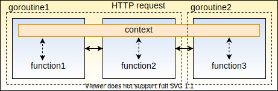
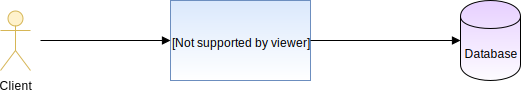
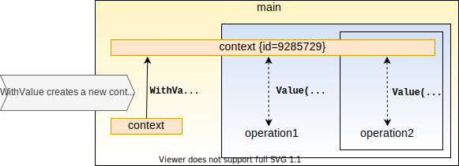

# Using Context in Golang - Cancellation, Timeouts and Values

In this post, we’ll learn about Go’s `context` package, and more specifically, how we can use cancellation to improve our applications performance.

We will also go through some patterns and best practices when using the `context` package in your Golang application.

## When Do We Use Context?

As the name suggests, we use the context package whenever we want to pass around “context”, or common scoped data within our application. For example:

- Request IDs for function calls and goroutines that are part of an HTTP request call
- Errors when fetching data from a database
- Cancellation signals whe performing async operations using goroutines



Using the `Context` data type is the idiomatic way to pass information across these kind of operations, such as:

1. Cancellation signals to terminate the operation
2. Miscellaneous data required at every function call invoked by the operation

Let’s talk about cancellation first:

## Why Do We Need Cancellation?

In short, we need cancellation to prevent our system from doing unnecessary work.

Consider the common situation of an HTTP server making a call to a database, and returning the queried data to the client:



The timing diagram, if everything worked perfectly, would look like this:


But, what would happen if the client cancelled the request in the middle? This could happen if, for example, the client closed their browser mid-request.

Without cancellation, the application server and database would continue to do their work, even though the result of that work would be wasted:


Ideally, we would want all downstream components of a process to halt, if we know that the process (in this example, the HTTP request) halted:


## Context Cancellation in Go

Now that we know why we need cancellation, let’s get into how you can implement it in Go.

Because “cancellation” is highly contextual to the operation being performed, the best way to implement it is through `context`.

There are two sides to context cancellation:

1. Listening for the cancellation event
2. Emitting the cancellation event

### Listening For Cancellation

The `Context` type provides a `Done()` method. This returns a channel that receives an empty `struct{}` type every time the context receives a cancellation event.

So, to listen for a cancellation event, we need to wait on `<- ctx.Done()`.

For example, lets consider an HTTP server that takes two seconds to process an event. If the request gets cancelled before that, we want to return immediately:

```go
func main() {
	// Create an HTTP server that listens on port 8000
	http.ListenAndServe(":8000", http.HandlerFunc(func(w http.ResponseWriter, r *http.Request) {
		ctx := r.Context()
		// This prints to STDOUT to show that processing has started
		fmt.Fprint(os.Stdout, "processing request\n")
		// We use `select` to execute a piece of code depending on which
		// channel receives a message first
		select {
		case <-time.After(2 * time.Second):
			// If we receive a message after 2 seconds
			// that means the request has been processed
			// We then write this as the response
			w.Write([]byte("request processed"))
		case <-ctx.Done():
			// If the request gets cancelled, log it
			// to STDERR
			fmt.Fprint(os.Stderr, "request cancelled\n")
		}
	}))
}
```

You can test this by running the server and opening [localhost:8000](http://localhost:8000/) on your browser. If you close your browser before 2 seconds, you should see “request cancelled” printed on the terminal window.

### Emitting a Cancellation Event

If you have an operation that could be cancelled, you will have to emit a cancellation event through the context.

This can be done using the `WithCancel` function in the context package, which returns a context object, and a function.

```go
ctx, fn := context.WithCancel(ctx)
```

This function takes no arguments, and does not return anything, and is called when you want to cancel the context.

Consider the case of 2 dependent operations. Here, “dependent” means if one fails, it doesn’t make sense for the other to complete. If we get to know early on that one of the operations failed, we would like to cancel all dependent operations.

```go
func operation1(ctx context.Context) error {
	// Let's assume that this operation failed for some reason
	// We use time.Sleep to simulate a resource intensive operation
	time.Sleep(100 * time.Millisecond)
	return errors.New("failed")
}

func operation2(ctx context.Context) {
	// We use a similar pattern to the HTTP server
	// that we saw in the earlier example
	select {
	case <-time.After(500 * time.Millisecond):
		fmt.Println("done")
	case <-ctx.Done():
		fmt.Println("halted operation2")
	}
}

func main() {
	// Create a new context
	ctx := context.Background()
	// Create a new context, with its cancellation function
	// from the original context
	ctx, cancel := context.WithCancel(ctx)

	// Run two operations: one in a different go routine
	go func() {
		err := operation1(ctx)
		// If this operation returns an error
		// cancel all operations using this context
		if err != nil {
			cancel()
		}
	}()

	// Run operation2 with the same context we use for operation1
	operation2(ctx)
}
```

## Context Timeouts

Any application that needs to maintain an SLA (service level agreement) for the maximum duration of a request, should use time based cancellation.

The API is almost the same as the previous example, with a few additions:

```go
// The context will be cancelled after 3 seconds
// If it needs to be cancelled earlier, the `cancel` function can
// be used, like before
ctx, cancel := context.WithTimeout(ctx, 3*time.Second)

// Setting a context deadline is similar to setting a timeout, except
// you specify a time when you want the context to cancel, rather than a duration.
// Here, the context will be cancelled on 2009-11-10 23:00:00
ctx, cancel := context.WithDeadline(ctx, time.Date(2009, time.November, 10, 23, 0, 0, 0, time.UTC))
```

For example, consider making an HTTP API call to an external service. If the service takes too long, it’s better to fail early and cancel the request:

```go
func main() {
	// Create a new context
	// With a deadline of 100 milliseconds
	ctx := context.Background()
	ctx, _ = context.WithTimeout(ctx, 100*time.Millisecond)

	// Make a request, that will call the google homepage
	req, _ := http.NewRequest(http.MethodGet, "http://google.com", nil)
	// Associate the cancellable context we just created to the request
	req = req.WithContext(ctx)

	// Create a new HTTP client and execute the request
	client := &http.Client{}
	res, err := client.Do(req)
	// If the request failed, log to STDOUT
	if err != nil {
		fmt.Println("Request failed:", err)
		return
	}
	// Print the status code if the request succeeds
	fmt.Println("Response received, status code:", res.StatusCode)
}
```

Based on how fast the google homepage responds to your request, you will receive:

```bash
Response received, status code: 200
```

or

```bash
Request failed: Get http://google.com: context deadline exceeded
```

You can play around with the timeout to achieve both of the above results.

## Context Values

You can use the context variable to pass around values that are common across an operation. This is the more idiomatic alternative to just passing them around as variables throughout your function calls.

For example, consider an operation that has multiple function calls, with a common ID used to identify it for logging and monitoring.

The naive way to implement this is the just pass the ID around for each function call:

```go
func main() {
	// create a random integer as the ID
	rand.Seed(time.Now().Unix())
	id := rand.Int()
	operation1(id)
}

func operation1(id int64) {
	// do some work
	log.Println("operation1 for id:", id, " completed")
	operation2(id)
}

func operation2(id int64) {
	// do some work
	log.Println("operation2 for id:", id, " completed")
}
```

This can quickly get bloated when you have more information that you want to provide.

We can implement the same functionality using context:

```go
// we need to set a key that tells us where the data is stored
const keyID = "id"

func main() {
	rand.Seed(time.Now().Unix())
	ctx := context.WithValue(context.Background(), keyID, rand.Int())
	operation1(ctx)
}

func operation1(ctx context.Context) {
	// do some work

	// we can get the value from the context by passing in the key
	log.Println("operation1 for id:", ctx.Value(keyID), " completed")
	operation2(ctx)
}

func operation2(ctx context.Context) {
	// do some work

	// this way, the same ID is passed from one function call to the next
	log.Println("operation2 for id:", ctx.Value(keyID), " completed")
}
```

Here, we’re creating a new context variable in `main` with a key value pair associated with it. The value can then be used by the successive function calls obtain contextual information.



Using the context variable to pass down operation-scoped information is useful for a number of reasons:

1. It is **thread safe**: You can’t modify the value of a context key once it has been set. The only way set another value for a given key is to create another context variable using context.WithValue
2. It is **conventional**: The context package is used throughout Go’s official libraries and applications to convey operation-scoped data. Other developers and libraries generally play nicely with this pattern.

## Gotchas and Caveats

Although context cancellation in Go is a versatile tool, there are a few things that you should keep in mind before proceeding. The most important of which, is that a context can only be cancelled once.

If there are multiple errors that you would want to propagate in the same operation, then using context cancellation may not the best option.

The most idiomatic way to use cancellation is when you actually want to cancel something, and not just notify downstream processes that an error has occurred.

Another important caveat has to do with wrapping the same context multiple times.

Wrapping an already cancellable context with `WithTimeout` or `WithCancel` will enable multiple locations in your code in which your context could be cancelled, and this should be avoided.

Reference: https://www.sohamkamani.com/golang/context-cancellation-and-values/