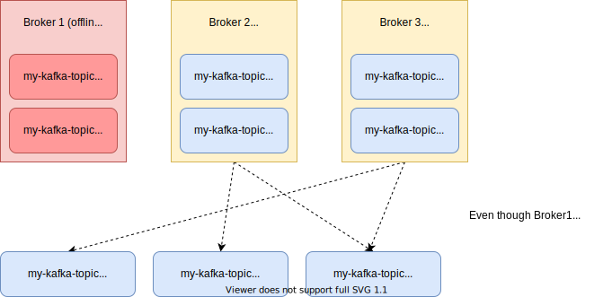

# How to Install and Run a Kafka Cluster Locally

This tutorial will show you how to install and run a Kafka cluster on your machine, and demonstrate some important concepts about the architecture of Kafka.

[Apache Kafka](https://kafka.apache.org/) is a distributed streaming platform. It can be used for anything ranging from a distributed message broker to a platform for processing data streams.

Let’s see how we can get a production quality Kafka cluster running with the least effort possible.

## Installation

First, we need to [install Java](https://www.oracle.com/java/technologies/javase-downloads.html) in order to run the Kafka executables.

Next, you can download Kafka’s binaries from [the official download page](https://archive.apache.org/dist/kafka/3.0.0/kafka_2.13-3.0.0.tgz) (this one is for v3.0.0). Extract the tar files in any location of you choice :

```bash
tar -xvzf kafka_2.13-3.0.0.tgz
```
You should see a folder named `kafka_2.13-3.0.0`, and inside you will see `bin` and `config` folders.

## System Architecture

There are a bunch of processes that we need to start to run our cluster :

1. **Zookeeper**: Which is used by Kafka to maintain state between the nodes of the cluster.
2. **Kafka brokers**: The “pipes” in our pipeline, which store and emit data.
3. **Producers**: That insert data into the cluster.
4. **Consumers**: That read data from the cluster.


*Note that each block in this diagram can be on a different system on the network.*

## Starting Zookeeper

[Zookeeper](https://zookeeper.apache.org/) is a distributed key-value store commonly used to store server state for coordination.

Kafka requires a Zookeeper server in order to run, so the first thing we need to do is start a Zookeeper instance.

Inside the extracted `kafka_2.13-3.0.0`, you will find some useful files:

- `bin/zookeeper-server-start.sh`: which is used to start the server.
- `config/zookeeper.properties`: which provides the default configuration for the Zookeeper server to run.

We can start the Zookeeper server by running:

```bash
bin/zookeeper-server-start.sh config/zookeeper.properties
```

*Make sure you are inside the `kafka_2.13-3.0.0` directory when executing this command.*

You should see a confirmation that the server has started:

```bash
[2021-11-24 17:17:30,659] INFO binding to port 0.0.0.0/0.0.0.0:2181 (org.apache.zookeeper.server.NIOServerCnxnFactory)
[2021-11-24 17:17:30,666] INFO Using org.apache.zookeeper.server.watch.WatchManager as watch manager (org.apache.zookeeper.server.watch.WatchManagerFactory)
[2021-11-24 17:17:30,666] INFO Using org.apache.zookeeper.server.watch.WatchManager as watch manager (org.apache.zookeeper.server.watch.WatchManagerFactory)
[2021-11-24 17:17:30,666] INFO zookeeper.snapshotSizeFactor = 0.33 (org.apache.zookeeper.server.ZKDatabase)
[2021-11-24 17:17:30,666] INFO zookeeper.commitLogCount=500 (org.apache.zookeeper.server.ZKDatabase)
[2021-11-24 17:17:30,669] INFO zookeeper.snapshot.compression.method = CHECKED (org.apache.zookeeper.server.persistence.SnapStream)
[2021-11-24 17:17:30,669] INFO Snapshotting: 0x0 to /tmp/zookeeper/version-2/snapshot.0 (org.apache.zookeeper.server.persistence.FileTxnSnapLog)
[2021-11-24 17:17:30,671] INFO Snapshot loaded in 5 ms, highest zxid is 0x0, digest is 1371985504 (org.apache.zookeeper.server.ZKDatabase)
[2021-11-24 17:17:30,671] INFO Snapshotting: 0x0 to /tmp/zookeeper/version-2/snapshot.0 (org.apache.zookeeper.server.persistence.FileTxnSnapLog)
[2021-11-24 17:17:30,672] INFO Snapshot taken in 1 ms (org.apache.zookeeper.server.ZooKeeperServer)
[2021-11-24 17:17:30,676] INFO PrepRequestProcessor (sid:0) started, reconfigEnabled=false (org.apache.zookeeper.server.PrepRequestProcessor)
[2021-11-24 17:17:30,676] INFO zookeeper.request_throttler.shutdownTimeout = 10000 (org.apache.zookeeper.server.RequestThrottler)
[2021-11-24 17:17:30,683] INFO Using checkIntervalMs=60000 maxPerMinute=10000 maxNeverUsedIntervalMs=0 (org.apache.zookeeper.server.ContainerManager)
[2021-11-24 17:17:30,683] INFO ZooKeeper audit is disabled. (org.apache.zookeeper.audit.ZKAuditProvider)
[2021-11-24 17:19:52,305] INFO Creating new log file: log.1 (org.apache.zookeeper.server.persistence.FileTxnLog)
```

If you inspect the `config/zookeeper.properties` file, you should see the `clientPort` property set to `2181`, which is the port that your Zookeeper server is currently listening on:

```bash
# File: kafka_2.13-3.0.0/config/zookeeper.properties

# the port at which the clients will connect
clientPort=2181
```

## Starting the Kafka Brokers

Kafka brokers are the heart of the cluster - they act as the pipelines where our data is stored and distributed.

Similar to how we started Zookeeper, there are two files meant to start (`bin/kafka-server-start.sh`) and configure (`config/server.properties`) the broker servers.

Since we want to demonstrate the distributed nature of kafka, let’s start up 3 brokers, as shown in the previous diagram.

If you open the `config/server.properties` file, you will see several configuration options (you can ignore most of them for now).

However, there are three properties that have to be unique for each broker instance:

```bash
File: kafka_2.13-3.0.0/config/server.properties

# The id of the broker. This must be set to a unique integer for each broker.
broker.id=0

# The address the socket server listens on. It will get the value returned from
listeners=PLAINTEXT://:9092

# A comma separated list of directories under which to store log files
log.dirs=/tmp/kafka-logs
```

Since we will have 3 servers, it’s better to maintain 3 configuration files for each server. Copy the `config/server.properties` file and make 3 files for each server instance:

```bash
cp config/server.properties config/server.1.properties
cp config/server.properties config/server.2.properties
cp config/server.properties config/server.3.properties
```

Change the above 3 properties for each copy of the file so that they are all unique.

**server.1.properties**

```properties
broker.id=1
listeners=PLAINTEXT://:9093
log.dirs=/tmp/kafka-logs1
```

**server.2.properties**

```properties
broker.id=2
listeners=PLAINTEXT://:9094
log.dirs=/tmp/kafka-logs2
```

**server.3.properties**

```properties
broker.id=3
listeners=PLAINTEXT://:9095
log.dirs=/tmp/kafka-logs3
```

Create the log directories that we configured:

```bash
mkdir /tmp/kafka-logs1
mkdir /tmp/kafka-logs2
mkdir /tmp/kafka-logs3
```

Finally, we can start the broker instances. Run the below three commands on different terminal sessions:

```bash
bin/kafka-server-start.sh config/server.1.properties
```

```bash
bin/kafka-server-start.sh config/server.2.properties
```

```bash
bin/kafka-server-start.sh config/server.3.properties
```

You should see a startup message when the brokers start successfully:

```bash
[2021-08-24 20:12:00,218] INFO [SocketServer listenerType=ZK_BROKER, nodeId=1] Started socket server acceptors and processors (kafka.network.SocketServer)
[2021-08-24 20:12:00,234] INFO Kafka version: 2.8.0 (org.apache.kafka.common.utils.AppInfoParser)
[2021-08-24 20:12:00,234] INFO Kafka commitId: ebb1d6e21cc92130 (org.apache.kafka.common.utils.AppInfoParser)
[2021-08-24 20:12:00,234] INFO Kafka startTimeMs: 1629816120218 (org.apache.kafka.common.utils.AppInfoParser)
[2021-08-24 20:12:00,241] INFO [KafkaServer id=1] started (kafka.server.KafkaServer)
```

## Creating Topics

Before we can start putting data into your cluster, we need to create a topic to which the data will belong. To do this, run the command:

```bash
bin/kafka-topics.sh --create --topic my-kafka-topic --bootstrap-server localhost:9093 --partitions 3 --replication-factor 2
```

Let’s explain some of the options here:

- `partitions` lets you decide how many brokers you want your data to be split between. Since we set up 3 brokers, we can set this option to 3.
- `replication-factor` describes how many copies of you data you want (in case one of the brokers goes down, you still have your data on the others). Since we set this value to 2, our data will have two copies of itself on any two of the brokers.
- `bootstrap-server` points to the address of any one of our active Kafka brokers. Since all brokers know about each other through Zookeeper, it doesn’t matter which one you choose.

**Note** - If you’re using Kafka version 2.x.x and below, you will have to use `--zookeeper localhost:2181` (the address of your Zookeeper instance) instead of `--bootstrap-server localhost:9093`


Once you create the topic, you should see a confirmation message:

```bash
Created topic my-kafka-topic.
```

## Listing Topics

If you want to list all available topics, you can run the `bin/kafka-topics.sh` as well:

```bash
bin/kafka-topics.sh --list --bootstrap-server localhost:9093
```

In this case it will only return one topic, which we created in the previous section:

```bash
my-kafka-topic
```

To get more details on a topic, you can use the `--describe` argument with the same command:

```bash
bin/kafka-topics.sh --describe --topic my-kafka-topic --bootstrap-server localhost:9093
```

Which will output information about the partitions and replicas of the topic:

```bash
Topic: my-kafka-topic   TopicId: 0ohYPRHiR_CDL5VlbSluCw PartitionCount: 3       ReplicationFactor: 2    Configs:
        Topic: my-kafka-topic   Partition: 0    Leader: 1       Replicas: 1,3   Isr: 1,3
        Topic: my-kafka-topic   Partition: 1    Leader: 2       Replicas: 2,1   Isr: 2,1
        Topic: my-kafka-topic   Partition: 2    Leader: 3       Replicas: 3,2   Isr: 3,2
```

## Producers: Sending Messages to a Topic

The “producer” is the process that puts data into our Kafka cluster. The command line tools in the `bin` directory provide us with a console producer, that inputs data into the cluster every time your enter text into the console.

To start the console producer, run the command:

```bash
bin/kafka-console-producer.sh --broker-list localhost:9093,localhost:9094,localhost:9095 --topic my-kafka-topic
```

- `broker-list` points the producer to the addresses of the brokers that we just provisioned
- `topic` specifies the topic you want the data to go to.

You should now see a command prompt, where you can enter text which gets inserted into the Kafka cluster every time you hit enter.

## Consumers

We can use Kafka consumers to read data from the cluster. In this case, we’ll read the data that we produced in the previous section.

To start a consumer, run the command:

```bash
bin/kafka-console-consumer.sh --bootstrap-server localhost:9093 --topic my-kafka-topic --from-beginning
```

- `bootstrap-server` can be any one of the brokers in the cluster
- `topic` should be the same as the topic under which you producers inserted data into the cluster.
- `from-beginning` tells the cluster that you want all the messages that it currently has with it, even messages that we put into it previously.

When you run the above command, you should immediately see all the messages that you input using the producer, logged onto your console.

If you input any more messages with the producer while the consumer is running, you should see it output into the console in real time.

> This way, Kafka acts like a **persistent message queue**, saving the messages that were not yet read by the consumer, while passing on new messages as they come while the consumer is running.

## Testing Replication: What if a Broker Goes Offline?

Now that the Kafka cluster is set up on our system, let’s test the replication of our data.

Shut down one of the three brokers that you ran, and you should see that your cluster is still running fine. This means that Kafka is tolerant to some of its nodes failing.

Try starting another consumer in a different terminal window:

```bash
bin/kafka-console-consumer.sh --bootstrap-server localhost:9093 --topic my-kafka-topic --from-beginning --group group2
```

The only thing we’ve added here is the `group` option, which differentiates one consumer from another. Once you run the command, you should see all messages getting logged on the console from the beginning.

Even though one of our brokers was shut down, our data was not lost. This is because the replication factor of 2 that we set earlier ensured that a copy of our data was present on multiple brokers.



You can play around with your setup in many more ways. What happens if you take down another broker? What if you had 5 brokers and took 2 of them down? What if you changed the replication factor for your topic?

The best way to know how resilient Kafka is, is to experiment with it yourself.

### Implementing Kafka Producers and Consumers

Once you have your cluster up and running, you can implement a producer and consumer in your application code.
