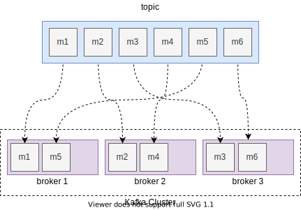
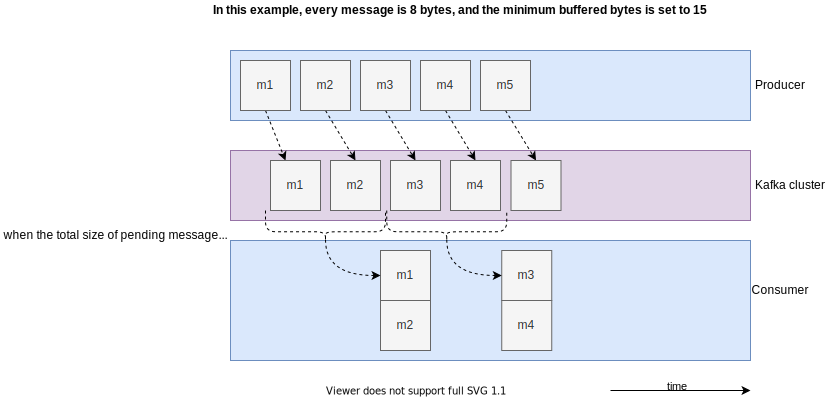
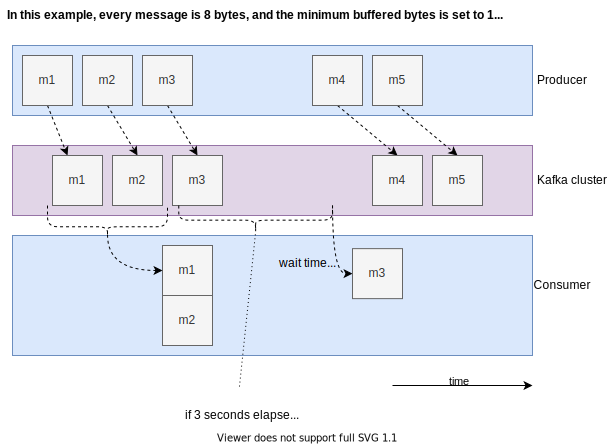
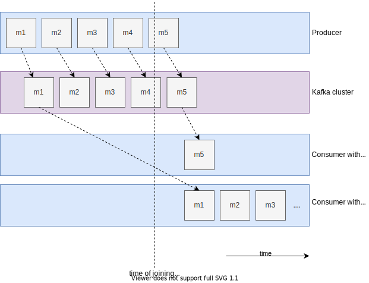
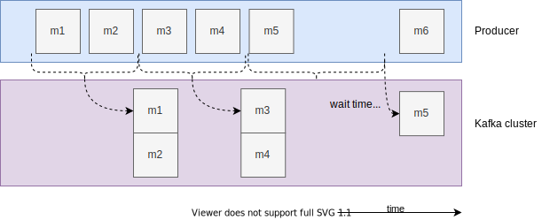
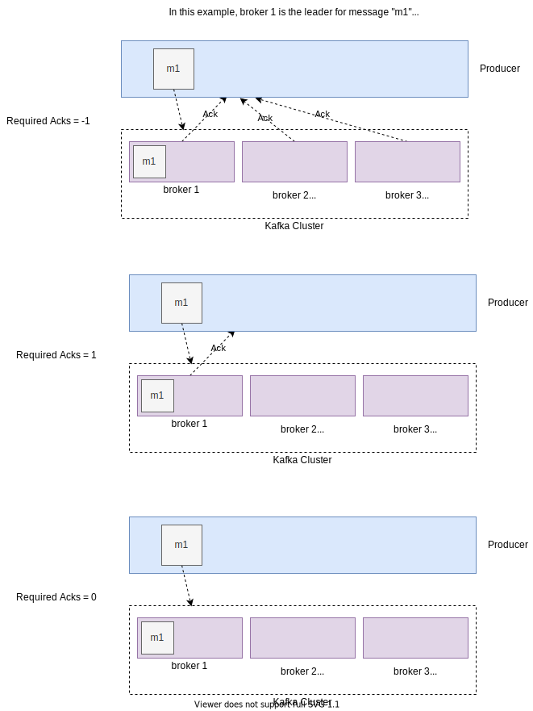

# Implementing a Kafka Producer and Consumer In Go

In this post we will learn how to create a **Kafka producer and consumer in Go**. We will also look at how to tune some configuration options to make our application **production-ready**.

[Kafka](https://kafka.apache.org/) is an open-source event streaming platform, used for publishing and processing events at high-throughput. There are a lot of popular libraries for Go in order to interface with Kafka. For this post, we will be using the [kafka-go](https://github.com/segmentio/kafka-go) library (but the same concepts will apply for any other library as well).

## Getting Started

First, make sure you have a running Kafka cluster on your machine.

Before diving into the code, we should know about **brokers** and **topics**, which will be needed by both the producer and consumer.

A “topic” can be thought of as a distinct queue or channel where messages are sent.

For most production applications, there isn’t a single Kafka server running, but rather a cluster of multiple servers called “brokers”. The messages for each topic are split amongst the various brokers.



To learn more about how each topic is split between the brokers, you can read the [official docs](https://kafka.apache.org/documentation/#intro_concepts_and_terms).

## Creating the Kafka Producer

For the purpose of illustration, let’s create a function that writes a message into the Kafka cluster every second, forever:

```go
// the topic and broker address are initialized as constants
const (
	topic          = "message-log"
	broker1Address = "localhost:9093"
	broker2Address = "localhost:9094"
	broker3Address = "localhost:9095"
)

func produce(ctx context.Context) {
	// initialize a counter
	i := 0

	// intialize the writer with the broker addresses, and the topic
	w := kafka.NewWriter(kafka.WriterConfig{
		Brokers: []string{broker1Address, broker2Address, broker3Address},
		Topic:   topic,
	})

	for {
		// each kafka message has a key and value. The key is used
		// to decide which partition (and consequently, which broker)
		// the message gets published on
		err := w.WriteMessages(ctx, kafka.Message{
			Key: []byte(strconv.Itoa(i)),
			// create an arbitrary message payload for the value
			Value: []byte("this is message" + strconv.Itoa(i)),
		})
		if err != nil {
			panic("could not write message " + err.Error())
		}

		// log a confirmation once the message is written
		fmt.Println("writes:", i)
		i++
		// sleep for a second
		time.Sleep(time.Second)
	}
}
```

## Creating the Kafka Consumer

When creating a consumer, we need to specify it’s **group ID**. This is because a single topic can have multiple consumers, and each consumers group ID ensures that multiple consumers belonging to the same group ID don’t get repeated messages.

Let’s create another `consume` function that consumes messages from the Kafka cluster whenever they’re available:

```go
func consume(ctx context.Context) {
	// initialize a new reader with the brokers and topic
	// the groupID identifies the consumer and prevents
	// it from receiving duplicate messages
	r := kafka.NewReader(kafka.ReaderConfig{
		Brokers: []string{broker1Address, broker2Address, broker3Address},
		Topic:   topic,
		GroupID: "my-group",
	})
	for {
		// the `ReadMessage` method blocks until we receive the next event
		msg, err := r.ReadMessage(ctx)
		if err != nil {
			panic("could not read message " + err.Error())
		}
		// after receiving the message, log its value
		fmt.Println("received: ", string(msg.Value))
	}
}
```

Now that we’ve defined the functions to send and receive messages, we can put it all together in the `main` function:

```go
func main() {
	// create a new context
	ctx := context.Background()
	// produce messages in a new go routine, since
	// both the produce and consume functions are
	// blocking
	go produce(ctx)
	consume(ctx)
}
```

If you run this code, you’ll see an output similar to this:

```bash
❯ go run main.go
writes: 0
writes: 1
writes: 2
writes: 3
writes: 4
received:  this is message0
received:  this is message1
received:  this is message2
received:  this is message3
received:  this is message4
writes: 5
writes: 6
writes: 7
writes: 8
received:  this is message5
received:  this is message6
received:  this is message7
received:  this is message8
writes: 9
```

Something to notice here is that we receive multiple messages at a time, even though we set the writes to take place with a break of one second.

This is because the Kafka client has some default settings that are great for large scale applications, but which you might want to modify if latency is a concern.

In the next section we’ll go through some configuration options that you can set to optimize the Kafka client for your needs.

## Tuning Kafka Client Configuration

There are a lot of options that you can configure when creating the Kafka producer and consumer. In this section we’ll go over some of the more important configuration options, and what they mean.

You can see the full list of configuration options [here](https://kafka.apache.org/documentation.html#configuration).

## Minimum Buffered Bytes

As we’ve seen from the previous example, the data received by the consumer isn’t exactly “real time”.

The consumer polls the Kafka brokers to check if there is enough data to receive. **The minimum buffered bytes defines what “enough” is**. For example, if we have a configuration like this:

```go
r := kafka.NewReader(kafka.ReaderConfig{
	Brokers:  []string{broker1Address, broker2Address, broker3Address},
	Topic:    topic,
	GroupID:  "my-group",
	MinBytes: 5,
	// the kafka library requires you to set the MaxBytes
	// in case the MinBytes are set
	MaxBytes: 1e6,
})
```

this means that if the consumer polls the cluster to check if there is any new data on the topic for the `my-group` consumer ID, the cluster will only respond if there are at least 5 new bytes of information to send.

In this example, every message is 8 bytes, and the minimum buffered bytes is set to 15.



> `MaxBytes`, on the other hand, defines the maximum quantity of data that the cluster can respond with when polled.

Setting `MinBytes` would help to receive the data in batches, which would reduce the overall throughput and load on your system. However, if there is a long period of time that elapses before the amount of new data crosses the `MinBytes` value, it would result in the previous data getting stuck for that amount of time.

## Max Wait Time

The [max wait time](https://kafka.apache.org/documentation.html#fetch.max.wait.ms) setting helps mitigate the problem discussed above. It sets the maximum time to wait between receiving messages from the Kafka cluster, regardless of the `MinBytes` setting.

So, if we set up our reader with the following config:

```go
r := kafka.NewReader(kafka.ReaderConfig{
	Brokers:  []string{broker1Address, broker2Address, broker3Address},
	Topic:    topic,
	GroupID:  "my-group",
	MinBytes: 5,
	MaxBytes: 1e6,
	// wait for at most 3 seconds before receiving new data
	MaxWait: 3 * time.Second,
})
```

that would mean that the consumer would have to wait at the most 3 seconds before receiving any new messages, even if the new messages did not cross the min bytes setting that we set previously.

In this example, every message is 8 bytes, and the minimum buffered bytes is set to 15 and max wait time is 3 seconds.



## Start Offset

When a new consumer is added to a topic, it has two options for where it wants to start consuming data from:

1. **Earliest** - The consumer will start consuming data for a topic starting from the earliest message that is available.
2. **Latest** - Only consume new messages that appear after the consumer has joined the cluster.



These are defined as the `FirstOffset` and `LastOffset` constants in the kafka library:

```go
r := kafka.NewReader(kafka.ReaderConfig{
	Brokers:  []string{broker1Address, broker2Address, broker3Address},
	Topic:    topic,
	GroupID:  "my-group",
	// this will start consuming messages from the earliest available
	StartOffset: kafka.FirstOffset,
	// if you set it to `kafka.LastOffset` it will only consume new messages
})
```

*Note that this only applies for new consumer groups. If you’ve already consumed data with the same consumer `GroupID` setting before, you will continue from wherever you left off.*

## Message Batching

So far we’ve looked at configuration on the consumer side. Let’s take a look at some producer/writer side configuration options.

Similar to the consumer, the producer also tries to send messages in batches. This is to reduce the total number of network round trips and improve efficiency in writing messages, but comes at the cost of increased overall latency.

When batching messages, we can set:

1. **Batch Size** - The total number of messages that should be buffered before writing to the Kafka brokers.
2. **Batch Timeout** - The maximum time before which messages are written to the brokers. That means that even if the message batch is not full, they will still be written onto the Kafka cluster once this time period has elapsed.



In our code, we can set this configuration using the `BatchSize` and `BatchTimeout` options:

```go
w := kafka.NewWriter(kafka.WriterConfig{
	Brokers: []string{broker1Address, broker2Address, broker3Address},
	Topic:   topic,
	// wait until we get 10 messages before writing
	BatchSize: 10,
	// no matter what happens, write all pending messages
	// every 2 seconds
	BatchTimeout: 2 * time.Second,
})
```

If you want your writer to immediately send every message it gets, set the batch size to 1.

## Required Acknowledgements

When we call the `w.WriteMessages` method in our example, it blocks the code until the message is confirmed to be written. However, the definition of what “confirmed” means can be different based on your settings.

Remember, the Kafka cluster (and your topic partitions) is distributed between multiple brokers. Of these, one of the brokers is the designated leader and the rest are followers.

Keeping this in mind, there are three modes of acknowledgement (represented by integers) when writing messages to the cluster:

1. All brokers acknowledge that they have received the message (represented as `-1`)
2. Only the leading broker acknowledges that it has received the messages (represented as `1`). The remaining brokers can still eventually receive the message, but we won’t wait for them to do so.
3. No one acknowledges receiving the message (represented as `0`). This is basically a fire-and-forget mode, where we don’t care if our message is received or not. This should only be used for data that you are ok with losing a bit of, but require high throughput for.



In our code, we can use the `RequiredAcks` option to set the maximum required acknowledgements:

```go
w := kafka.NewWriter(kafka.WriterConfig{
	Brokers: []string{broker1Address, broker2Address, broker3Address},
	Topic:   topic,
	// can be set to -1, 0, or 1
	// 1 is a good default for most non-transactional data
	RequiredAcks: 1,
})
```

## Logging Options

In our example, we printed to the console every time a messages was written or read. We may want more information sometimes for debugging or to know more about our cluster.

The `kafka-go` library comes with the option of providing a logger that can provide more detailed information about the state of your kafka brokers.

Both the reader and writer come with a `Logger` option that can be set to any value implementing the following interface:

```go
type Logger interface {
	Printf(string, ...interface{})
}
```

For our example, we can use the `log` standard library and assign a logger object to the reader:

```go
// create a new logger that outputs to stdout
// and has the `kafka reader` prefix
l := log.New(os.Stdout, "kafka reader: ", 0)
r := kafka.NewReader(kafka.ReaderConfig{
	Brokers: []string{broker1Address, broker2Address, broker3Address},
	Topic:   topic,
	GroupID: "my-group",
	// assign the logger to the reader
	Logger: l,
})
```

and the writer:

```go
l := log.New(os.Stdout, "kafka writer: ", 0)
w := kafka.NewWriter(kafka.WriterConfig{
	Brokers: []string{broker1Address, broker2Address, broker3Address},
	Topic:   topic,
	Logger: l,
})
```

When running the program, we can see that the output contains much more information than before:

```bash
❯ go run main.go
kafka reader: entering loop for consumer group, my-group
kafka reader: joined group my-group as member main@Soham-Kamani (github.com/segmentio/kafka-go)-fd575578-23a6-436b-bf77-a6642227dc67 in generation 31
kafka reader: selected as leader for group, my-group
kafka reader: using 'range' balancer to assign group, my-group
kafka reader: found member: main@Soham-Kamani (github.com/segmentio/kafka-go)-fd575578-23a6-436b-bf77-a6642227dc67/[]byte(nil)
kafka reader: found topic/partition: message-log/0
kafka reader: assigned member/topic/partitions main@Soham-Kamani (github.com/segmentio/kafka-go)-fd575578-23a6-436b-bf77-a6642227dc67/message-log/[0]
kafka reader: joinGroup succeeded for response, my-group.  generationID=31, memberID=main@Soham-Kamani (github.com/segmentio/kafka-go)-fd575578-23a6-436b-bf77-a6642227dc67
kafka reader: Joined group my-group as member main@Soham-Kamani (github.com/segmentio/kafka-go)-fd575578-23a6-436b-bf77-a6642227dc67 in generation 31
kafka reader: Syncing 1 assignments for generation 31 as member main@Soham-Kamani (github.com/segmentio/kafka-go)-fd575578-23a6-436b-bf77-a6642227dc67
kafka reader: sync group finished for group, my-group
kafka reader: subscribed to partitions: map[0:3132]
kafka reader: initializing kafka reader for partition 0 of message-log starting at offset 3132
kafka reader: started heartbeat for group, my-group [3s]
kafka reader: started commit for group my-group
kafka reader: the kafka reader for partition 0 of message-log is seeking to offset 3132
kafka writer: writing 1 messages to message-log (partition: 0)
writes: 0
kafka writer: writing 1 messages to message-log (partition: 0)
writes: 1
kafka writer: writing 1 messages to message-log (partition: 0)
writes: 2
kafka writer: writing 1 messages to message-log (partition: 0)
writes: 3
kafka writer: writing 1 messages to message-log (partition: 0)
writes: 4
kafka reader: committed offsets for group my-group:
	topic: message-log
		partition 0: 3133
received:  this is message0
kafka reader: committed offsets for group my-group:
	topic: message-log
		partition 0: 3134
received:  this is message1
kafka reader: committed offsets for group my-group:
	topic: message-log
		partition 0: 3135
received:  this is message2
kafka reader: committed offsets for group my-group:
	topic: message-log
		partition 0: 3136
received:  this is message3
kafka reader: committed offsets for group my-group:
	topic: message-log
		partition 0: 3137
received:  this is message4
kafka writer: writing 1 messages to message-log (partition: 0)
writes: 5
kafka writer: writing 1 messages to message-log (partition: 0)
writes: 6
```

> Although detailed logging can be helpful in a non-production environment, you should be careful before using it in production, to prevent your logs from being polluted with too much information.

## Further Reading

This post has covered most of the important options that I personally use in a production environment, but is by no means exhaustive.

There are many more configuration options that you may find important for your use case. You can read the full list [here](https://kafka.apache.org/documentation/#configuration).

For library specific options, you can see the kafka-go docs for [readers](https://godoc.org/github.com/segmentio/kafka-go#ReaderConfig) and [writers](https://godoc.org/github.com/segmentio/kafka-go#WriterConfig).
