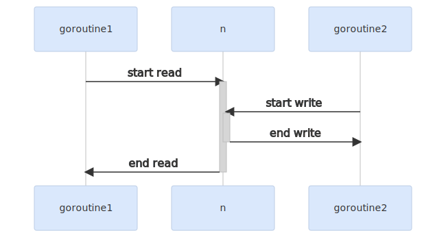
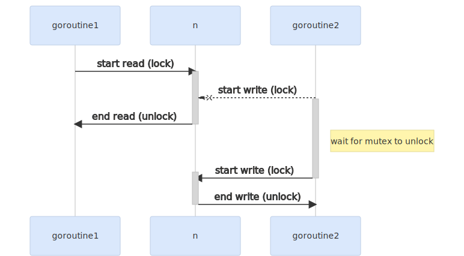
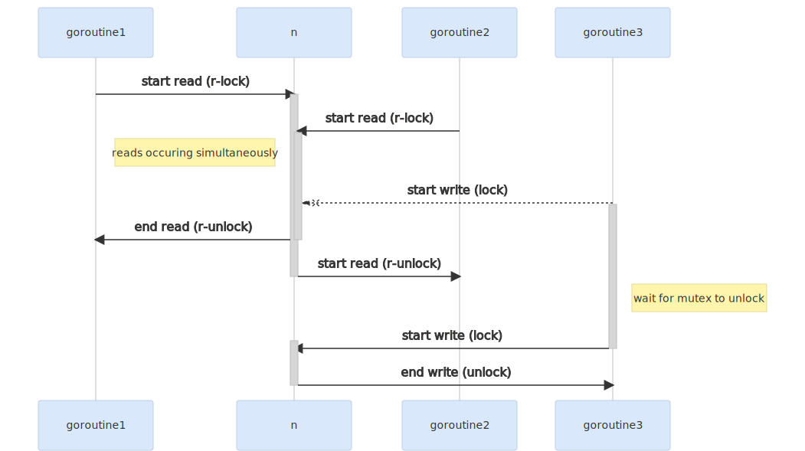

# Using a Mutex in Go

In this post, we’ll discuss why we use mutexes in Go, and learn how to use a mutex to place a lock on data and fix race conditions.

Go allows us to run code concurrently using goroutines. However, when concurrent processes access the same piece of data, it can lead to race conditions.

Mutexes are data structures provided by the `sync` package. They can help us place a lock on different sections of data so that only one goroutine can access it at a time.

## Using A Mutex To Lock Data

Let’s take a look at an example, where concurrent goroutines can corrupt a piece of data by accessing it simultaneously:

```go
// a simple function that returns true if a number is even
func isEven(n int) bool {
	return n%2 == 0
}

func main() {
	n := 0

  // goroutine 1
	// reads the value of n and prints true if its even
	// and false otherwise
	go func() {
		nIsEven := isEven(n)
    // we can simulate some long running step by sleeping
		// in practice, this can be some file IO operation
		// or a TCP network call
		time.Sleep(5 * time.Millisecond)
		if nIsEven {
			fmt.Println(n, " is even")
			return
		}
		fmt.Println(n, "is odd")
	}()

  // goroutine 2
	// modifies the value of n
	go func() {
		n++
	}()

	// just waiting for the goroutines to finish before exiting
	time.Sleep(time.Second)
}
```

Running this code, will give us the following unexpected output:

```bash
1  is even
```

This happens because goroutine 1 actually accesses n twice: once to check if it’s even, and again to print its value. In between these steps, goroutine 2 increments the value of `n`.

The value that is printed is now different from the value that was checked. This is known as a data race.



We should ensure that `n` should not be written to incase another goroutine is reading it, and vice versa.

We can use the `sync.Mutex` type to prevent multiple goroutines from accessing `n` at the same time:

```go
func main() {
	n := 0
	var m sync.Mutex

	// now, both goroutines call m.Lock() before accessing `n`
	// and call m.Unlock once they are done
	go func() {
		m.Lock()
		defer m.Unlock()
		nIsEven := isEven(n)
		time.Sleep(5 * time.Millisecond)
		if nIsEven {
			fmt.Println(n, " is even")
			return
		}
		fmt.Println(n, "is odd")
	}()

	go func() {
		m.Lock()
		n++
		m.Unlock()
	}()

	time.Sleep(time.Second)
}
```

Calling `m.Lock` will “lock” the mutex. If any other goroutine calls `m.Lock`, it will block the thread until `m.Unlock` is called.

If a goroutine calls `m.Lock` before its first read/write access to the relevant data, and calls `m.Unlock` after its last, it is guaranteed that between this period, the goroutine will have exclusive access to the data.

*If you want to hold a lock for the entire scope of a function, it’s better to `defer` the `Unlock` call, rather than calling it yourself at the end.*



This is why, when we run the above code, we get the correct output:

```bash
0  is even
```

## Reader/Writer Mutex - The sync.RWMutex Type

Sometimes, it’s ok for data to have concurrent reads, as long as the writes stay atomic.

In this case, we can a `sync.RWMutex` type, which has different locks for reading and writing to data:

```go
package main

import (
	"fmt"
	"sync"
	"time"
)

func isEven(n int) bool {
	return n%2 == 0
}

func main() {
	n := 0
	var m sync.RWMutex

	// goroutine 1
	// Since we are only reading data here, we can call the `RLock`
	// method, which obtains a read-only lock
	go func() {
		m.RLock()
		defer m.RUnlock()
		nIsEven := isEven(n)
		time.Sleep(5 * time.Millisecond)
		if nIsEven {
			fmt.Println(n, " is even")
			return
		}
		fmt.Println(n, "is odd")
	}()

  // goroutine 2
	go func() {
		m.RLock()
		defer m.RUnlock()
		nIsPositive := n > 0
		time.Sleep(5 * time.Millisecond)
		if nIsPositive {
			fmt.Println(n, " is positive")
			return
		}
		fmt.Println(n, "is not positive")
	}()

  // goroutine 3
	// Since we are writing into data here, we use the
	// `Lock` method, like before
	go func() {
		m.Lock()
		n++
		m.Unlock()
	}()

	time.Sleep(time.Second)
}
```

When running this code, we can observe that goroutines 1 and 2 can access `n` concurrently, but the **reads (1 and 2) and writes (3) are locked from each other**, and one can only start if the other has completed.



This can make your application more performant if it reads this data multiple times, since reads can happen concurrently.

## Adding Mutexes Into Structs

If you want to bundle a mutex along with its data, you can consider using struct composition.

If we wanted to do this for the previous example, we could create a struct to hold the number value, and include a mutex as well:

```go
type intLock struct {
	val int
	sync.Mutex
}

func (n *intLock) isEven() bool {
	return n.val%2 == 0
}
```

We can then use the mutex within the struct itself to handle locking and unlocking:

```go
func main() {
	n := &intLock{val: 0}

	go func() {
		n.Lock()
		defer n.Unlock()
		nIsEven := n.isEven()
		time.Sleep(5 * time.Millisecond)
		if nIsEven {
			fmt.Println(n.val, " is even")
			return
		}
		fmt.Println(n.val, "is odd")
	}()

	go func() {
		n.Lock()
		n.val++
		n.Unlock()
	}()

	time.Sleep(time.Second)
}
```

Running this code will give the same result as before.

This is useful for a couple of reasons:

1. If you have multiple instances of data that needs exclusive access, bundling a mutex along with the data itself will make it less confusing, and more readable
2. The data can be passed along as function arguments, and the mutex will be passed on by default

Unless you need a common mutex for multiple pieces of data, it’s better to include a mutex within a struct as a good practice.

## Common Pitfalls

Although mutexes may seem like a great solution, it’s easy to fall into some common traps.

**Whenever you call the `Lock` method, you must ensure that `Unlock` is eventually called**. This may seem straightforward, but is easy to miss. Consider this example:

```go
go func() {
	n.Lock()
	nIsEven := n.isEven()
	time.Sleep(5 * time.Millisecond)
	if nIsEven {
		fmt.Println(n.val, " is even")
		// mutex is never unlocked
		return
	}
	fmt.Println(n.val, "is odd")
	n.Unlock()
}()
```

Here, we call the `Unlock` method at the end of the function, instead of using `defer`. Now, if `n` is even, we will print the corresponding statement, and return from the goroutine, but `Unlock` would never be called.

If this happens, any goroutine looking to access the same lock will be blocked forever. Using `defer` to call the `Unlock` method can help you avoid this.

**Always release the lock as soon as you’re done accessing the data, and never later** - You’ll just be wasting resources.

For example, if you had to do some work after accessing `n`, using `defer` may not be appropriate:

```go
go func() {
	n.Lock()
	defer n.Unlock()
	nIsEven := n.isEven()
	time.Sleep(5 * time.Millisecond)
	if nIsEven {
		fmt.Println(n.val, " is even")
		return
	}
	fmt.Println(n.val, "is odd")

	// some work after printing
	time.Sleep(5 * time.Millisecond)
}()
```

In this case, `n.Unlock` will be called after the last `time.Sleep` call, even though we can release the lock as soon as we finish printing the result. By using `defer`, we’ve potentially delayed other goroutines which require access to this lock.

In cases like these, it’s better to manually release the lock once you’re done accessing the data:

```go
go func() {
	n.Lock()
	nIsEven := n.isEven()
	time.Sleep(5 * time.Millisecond)
	if nIsEven {
		fmt.Println(n.val, " is even")
		// unlock before returning
		n.Unlock()
		return
	}
	fmt.Println(n.val, "is odd")
	// unlock after printing `n`s value
	n.Unlock()

	// we can now release the lock 5ms earlier
	time.Sleep(5 * time.Millisecond)
}()
```

In summary, **a mutex is a great tool for preventing out-of-order data access**. There are multiple ways to use a mutex, and many pitfalls that can occur, so make sure to evaluate your use-case before deciding the right approach.

To know more about mutexes in Go, you can see the “sync” standard library [documentation page](https://pkg.go.dev/sync#Mutex).