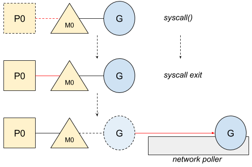
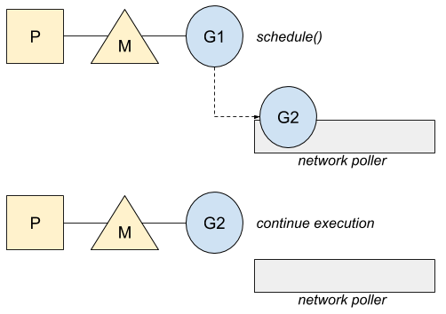

# Go: Goroutine, OS Thread and CPU Management


*This article is based on Go 1.13.*

Creating an OS Thread or switching from one to another can be costly for your programs in terms of memory and performance. Go aims to get advantages as much as possible from the cores. It has been designed with concurrency in mind from the beginning.

## M, P, G orchestration

To solve this problem, Go has its own scheduler to distribute goroutines over the threads. This scheduler defines three main concepts, as [explained in the code itself](https://golang.org/src/runtime/proc.go):

```
The main concepts are:
G - goroutine.
M - worker thread, or machine.
P - processor, a resource that is required to execute Go code.
    M must have an associated P to execute Go code[...].
```

Here is a diagram of this P, M, G model:


Each goroutine (G) runs on an OS thread (M) that is assigned to a logical CPU (P). Let’s take a simple example to see how Go manages them:

```go
func main() {
    var wg sync.WaitGroup
    wg.Add(2)

    go func() {
        println(`hello`)
        wg.Done()
    }()

    go func() {
        println(`world`)
        wg.Done()
    }()

    wg.Wait()
}
```

Go will first create the different P based on the number of logical CPUs of the machine and store them in a list of idle P:


Then, the new goroutine or goroutines ready to run will wake a P up to distribute the work better. This P will create an M with the associated OS thread:


However, like a P, a M with no work — i.e. no goroutine waiting to run — returning from a syscall, or even forced to be stopped by the garbage collector, goes to an idle list:


During the bootstrap of the program, Go already creates some OS thread and associated M. For our example, the first goroutine that prints hello will use the main goroutine while the second one will get an M and P from this idle list:


Now we have the big picture of the goroutines and threads management, let’s see in which case Go would use more M than P and how goroutines are managed in case of system calls.

## System calls

Go optimizes the system calls — whatever it is blocking or not — by wrapping them up in the runtime. This wrapper will automatically dissociate the P from the thread M and allow another thread to run on it. Let’s take an example with a file reading:

```go
func main() {
    buf := make([]byte, 0, 2)

    fd, _ := os.Open("number.txt")
    fd.Read(buf)
    fd.Close()

    println(string(buf)) // 42
}
```

Here is the workflow when the file is opening:


P0 is now in the idle list and potentially available. Then, once the syscall exits, Go applies the following rules until one can be satisfied:

- try to acquire the exact same P, P0 in our example, and resume the execution
- try to acquire a P in the idle list and resume the execution
- put the goroutine in the global queue and put the associated M back to the idle list

However, Go also handles the case when the resource is not ready yet in case of non-blocking I/O such as http call. In this case, the first syscall — that follows the previous workflow — will not succeed since the resource is not yet ready, forcing Go to use the network poller and park the goroutine. Here is an example:

```go
func main() {
    http.Get(`https://httpstat.us/200`)
}
```

Once the first syscall is done and explicitly says the resource is not yet ready, the goroutine will park until the network poller notifies it that the resource is now ready. In this case, the thread M will not be blocked:



The goroutine will run again when the Go scheduler looks for work. The scheduler will then ask the network poller if a goroutine is waiting to be run after successfully getting the information it was waiting for:



If more than one goroutine is ready, the extra ones will go on the global runnable queue and will be scheduled later.

## Restriction in term of OS threads

When system calls are used, Go does not limit the number of OS threads that can be blocked, as explained in code:

```
The GOMAXPROCS variable limits the number of operating system threads that can execute user-level Go code simultaneously. There is no limit to the number of threads that can be blocked in system calls on behalf of Go code; those do not count against the GOMAXPROCS limit. This package’s GOMAXPROCS function queries and changes the limit.
```

Here is an example of this situation:

```go
func main() {
    var wg sync.WaitGroup

    for i := 0;i < 100 ;i++  {
        wg.Add(1)

        go func() {
            http.Get(`https://httpstat.us/200?sleep=10000`)

            wg.Done()
        }()
    }

    wg.Wait()
}
```

Here are the number of threads created from the tracing tools:


Since Go optimizes the thread usage, it can be re-used while its goroutine is blocking, it explains why this number does not match with the number of the loop.
