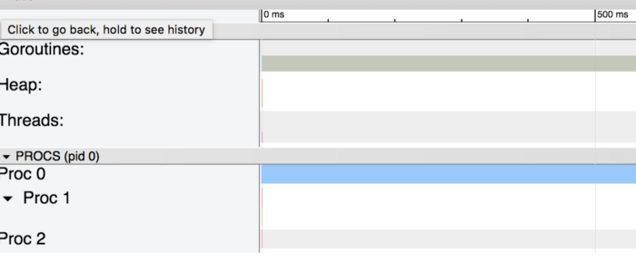
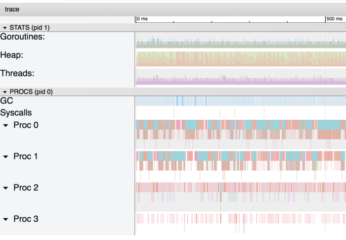
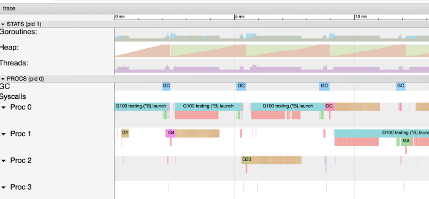
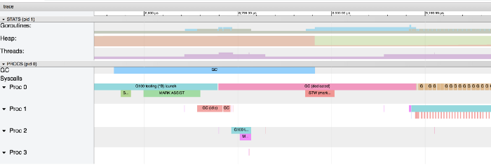

# Go: Should I Use a Pointer instead of a Copy of my Struct?

For many Go developers, the systematic use of pointers to share structs instead of the copy itself seems the best option in terms of performance.

In order to understand the impact of using a pointer rather than a copy of the struct, we will review two use cases.

## Intensive allocation of data

Let’s take a simple example of when you want to share a struct for its values:

```go
type S struct {
    a, b, c int64
    d, e, f string
    g, h, i float64
}
```

Here is a basic struct that can be shared by copy or by pointer:

```go
func byCopy() S {
    return S{
        a: 1, b: 1, c: 1,
        e: "foo", f: "foo",
        g: 1.0, h: 1.0, i: 1.0,
    }
}

func byPointer() *S {
    return &S{
        a: 1, b: 1, c: 1,
        e: "foo", f: "foo",
        g: 1.0, h: 1.0, i: 1.0,
    }
}
```

Based on those 2 methods, we can now write 2 benchmarks, one where the struct is passed by copy:

```go
func BenchmarkMemoryStack(b *testing.B) {
    var s S

    f, err := os.Create("stack.out")
    if err != nil {
        panic(err)
    }
    defer f.Close()

    err = trace.Start(f)
    if err != nil {
        panic(err)
    }

    for i := 0; i < b.N; i++ {
        s = byCopy()
    }

    trace.Stop()

    b.StopTimer()

    _ = fmt.Sprintf("%v", s.a)
}
```

And another one, very similar, when it is passed by pointer:

```go
func BenchmarkMemoryHeap(b *testing.B) {
    var s *S

    f, err := os.Create("heap.out")
    if err != nil {
        panic(err)
    }
    defer f.Close()

    err = trace.Start(f)
    if err != nil {
        panic(err)
    }

    for i := 0; i < b.N; i++ {
        s = byPointer()
    }

    trace.Stop()

    b.StopTimer()

    _ = fmt.Sprintf("%v", s.a)
}
```

Let’s run the benchmarks:

```
go test ./... -bench=BenchmarkMemoryHeap -benchmem -run=^$ -count=10 > head.txt && benchstat head.txt
go test ./... -bench=BenchmarkMemoryStack -benchmem -run=^$ -count=10 > stack.txt && benchstat stack.txt
```

Here are the stats:

```
name          time/op
MemoryHeap-4  75.0ns ± 5%

name          alloc/op
MemoryHeap-4   96.0B ± 0%

name          allocs/op
MemoryHeap-4    1.00 ± 0%

------------------

name           time/op
MemoryStack-4  8.93ns ± 4%

name           alloc/op
MemoryStack-4   0.00B

name           allocs/op
MemoryStack-4    0.00
```

*Using a copy of the struct instead of a pointer here is 8 times faster.*

In order to understand why, let’s have a look at the graphs generated by the trace:





The first graph is quite simple. Since there is no usage of the heap, there is no garbage collector and no extra goroutine.

For the second graph, the usage of the pointers force the go compiler to [escape the variable to the heap](https://golang.org/doc/faq#stack_or_heap) and put pressure on the garbage collector. If we zoom in on the graph, we can see that the garbage collector takes an important part of the processus:



We can see on this graph that the garbage collector must to work every 4ms.

If we zoom again, we can get details of exactly what is happening:



The blue, pink and red ones are the phases of the garbage collector, while the brown ones are related to the allocation on the heap (marked with “runtime.bgsweep” on the graph):


*Sweeping is when the memory associated with values in heap memory that were not marked as in-use are reclaimed. This activity occurs when application Goroutines attempt to allocate new values in heap memory. The latency of Sweeping is added to the cost of performing an allocation in heap memory and is not tied to any latencies associated with garbage collection.*

*https://www.ardanlabs.com/blog/2018/12/garbage-collection-in-go-part1-semantics.html*

Even if this example is a bit extreme, we can see how it can be costly to allocate a variable on the heap rather than the stack. In our example, the code is much faster to allocate a struct on the stack and copy it than allocate it on the heap and share its address.

If you are not familiar with the stack/heap and if you would like to understand more about the internal details of each, you can find many resources online, like this [article](https://www.gribblelab.org/CBootCamp/7_Memory_Stack_vs_Heap.html) by Paul Gribble.

It could be even worse if we would limit the processor to 1 with GOMAXPROCS=1:

```name        time/op
MemoryHeap  114ns ± 4%

name        alloc/op
MemoryHeap  96.0B ± 0%

name        allocs/op
MemoryHeap   1.00 ± 0%

------------------

name         time/op
MemoryStack  8.77ns ± 5%

name         alloc/op
MemoryStack   0.00B

name         allocs/op
MemoryStack    0.00
```

If the benchmark with allocation on the stack does not change, the one on the heap has decreases from 75ns/op to 114ns/op.

## Intensive function calls

For this second use case, we will add two empty methods to our struct with a slight adaptation of our benchmarks:

```go
func (s S) stack(s1 S) {}

func (s *S) heap(s1 *S) {}
```

The benchmark with allocation on the stack will create a struct and pass it by copy:

```go
func BenchmarkMemoryStack(b *testing.B) {
    var s S
    var s1 S

    s = byCopy()
    s1 = byCopy()
    for i := 0; i < b.N; i++ {
        for i := 0; i < 1000000; i++  {
            s.stack(s1)
        }
    }
}
```

And the benchmark for the heap will pass the struct by pointer:

```go
func BenchmarkMemoryHeap(b *testing.B) {
    var s *S
    var s1 *S

    s = byPointer()
    s1 = byPointer()
    for i := 0; i < b.N; i++ {
        for i := 0; i < 1000000; i++ {
            s.heap(s1)
        }
    }
}
```

As expected, the results are quite different now:

```
name          time/op
MemoryHeap-4  301µs ± 4%

name          alloc/op
MemoryHeap-4  0.00B

name          allocs/op
MemoryHeap-4   0.00

------------------

name           time/op
MemoryStack-4  595µs ± 2%

name           alloc/op
MemoryStack-4  0.00B

name           allocs/op
MemoryStack-4   0.00
```

## Conclusion

Using a pointer rather than a copy of a struct in go is not always a good thing.
In order to choose the good semantic for your data, I strongly suggest reading the [post about the value/pointer semantic](https://www.ardanlabs.com/blog/2017/06/design-philosophy-on-data-and-semantics.html) written by Bill Kennedy. It will give you a better view about the strategies you could use with your struct and built-in types.

Also, the profiling of your memory usage will definitely help you to figure out what is happening with your allocations and your heap.
